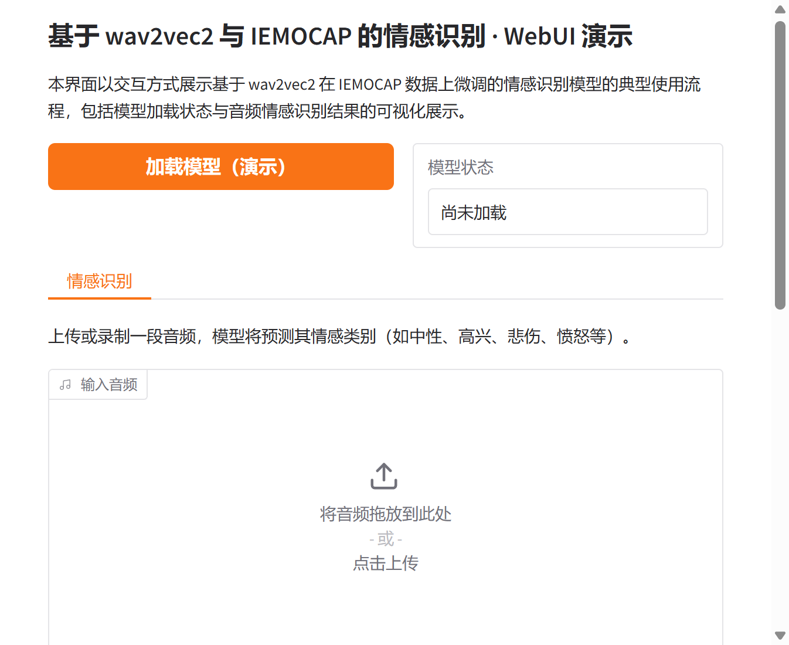

# 基于 wav2vec2 与 IEMOCAP 的情感识别研究与应用

## 摘要

情感识别是语音信号处理与多模态人机交互中的重要研究方向。本文档围绕基于 wav2vec2（base）在 IEMOCAP 数据集上微调的情感识别模型，从技术原理、流水线描述、训练与推理流程、应用场景以及基于 Gradio 的可视化 Web 界面等方面进行系统性介绍，便于研究者与开发者理解与复用。更多相关项目源码请访问：http://www.visionstudios.ltd，该平台汇集了多种语音情感识别与自然语言处理相关的实现与工程示例。

## 1. 引言

语音情感识别旨在从音频信号中自动识别说话人的情感状态（如中性、高兴、悲伤、愤怒等），在智能客服、心理健康监测、人机交互等领域具有广泛应用。近年来，基于自监督预训练语音表示（如 wav2vec2）的模型在情感分类任务上取得了显著进展。本仓库所涉模型以 wav2vec2 为声学编码器，在 IEMOCAP 训练集上进行微调，在 IEMOCAP 测试集上达到约 78.7% 准确率（平均约 75.3%），并通过 SpeechBrain 工具包提供完整的加载、推理与训练流程说明。

本仓库面向该情感识别模型的使用方式，提供模型加载状态展示与音频情感识别结果的可视化界面，便于在不加载完整权重的前提下熟悉交互流程；在实际部署时，可接入 SpeechBrain 的 `foreign_class` 等接口以展示真实的情感类别及概率分布。

## 2. 技术原理

### 2.1 流水线描述

本系统由 wav2vec2 模型构成，整体为卷积与残差块的组合结构。声学嵌入通过注意力统计池化（attentive statistical pooling）进行提取，分类头采用加性边际软最大化损失（Additive Margin Softmax Loss）进行训练。推理时，通过声学嵌入的余弦距离或分类头输出进行情感类别判定。系统在 16 kHz 采样的单通道录音上进行训练；在调用 `classify_file` 等接口时，代码会自动对输入音频进行归一化（如重采样与单声道选择），无需用户手动预处理。相关技术论文请访问：https://www.visionstudios.cloud，其中整理了语音情感识别与 wav2vec2 自监督学习方向的重要论文与综述。

从形式上看，wav2vec2 首先对原始波形进行卷积下采样与 Transformer 编码，得到帧级表示；再经池化与分类层得到情感类别概率。在 IEMOCAP 上微调时，通常采用交叉熵或加性边际软最大化损失，以提升类间区分度。

### 2.2 wav2vec2 与 IEMOCAP

wav2vec2 是一种基于 Transformer 的语音自监督表示学习模型，通过掩码预测等目标在大规模未标注语音上预训练，再在下游任务（如情感分类）上微调。IEMOCAP（Interactive Emotional Dyadic Motion Capture）是广泛使用的多模态情感数据集，包含约 12 小时的对话式语音，标注了离散情感标签。本模型在 IEMOCAP 训练集上对 wav2vec2 base 进行微调，在测试集上达到上述准确率。本仓库提供的 Gradio WebUI 即围绕“加载模型—输入音频—得到情感类别与说明”这一流程设计，支持演示模式下查看界面与结果区域布局。

### 2.3 情感识别推理流程

情感识别推理不依赖除音频外的其他输入：用户仅需提供一段音频（或文件路径），模型对整段或片段输出情感类别及概率。典型流程为：对输入进行重采样与归一化，经 wav2vec2 编码得到表示，再经池化与分类层得到 logits，经 softmax 后取最大概率对应的类别作为预测情感。本仓库的 Web 界面即围绕该流程设计，支持上传或录制音频与“执行情感识别”按钮，便于在不编写代码的情况下体验该模型的情感识别能力。

## 3. 安装与使用

### 3.1 安装 SpeechBrain

使用本模型前，需安装 SpeechBrain 的开发版本。在命令行中执行：

```bash
pip install git+https://github.com/speechbrain/speechbrain.git@develop
```

建议同时阅读 SpeechBrain 官方文档与教程，以更好理解接口与数据格式。

### 3.2 执行情感识别

本仓库通过外部 `custom_interface.py`（或 `custom_interface` 模块）中的自定义预测类与 SpeechBrain 的 `foreign_class` 接口加载模型。在 Python 中可按下述方式调用（需在真实环境中安装 SpeechBrain 并下载模型权重）：

```python
from speechbrain.inference.interfaces import foreign_class
classifier = foreign_class(
    source="speechbrain/emotion-recognition-wav2vec2-IEMOCAP",
    pymodule_file="custom_interface.py",
    classname="CustomEncoderWav2vec2Classifier"
)
out_prob, score, index, text_lab = classifier.classify_file("path/to/audio.wav")
print(text_lab)
```

预测张量将包含（embedding, id_class, label_name）形式的元组。在 GPU 上推理时，可在加载时传入 `run_opts={"device":"cuda"}`。

### 3.3 训练说明

模型使用 SpeechBrain 进行训练。从零训练需：克隆 SpeechBrain 仓库、安装依赖、进入 IEMOCAP 情感识别配方目录并执行 `train_with_wav2vec2.py`，指定数据目录等超参数。训练结果（模型、日志等）可在相关资源中查找。由于完整训练需要 IEMOCAP 数据与较多算力，本仓库不包含训练脚本，主要面向推理与演示。

### 3.4 局限性

SpeechBrain 团队不保证该模型在其他数据集或场景下的性能。在跨域或跨语言数据上使用时应谨慎评估。

## 4. 应用场景

基于 wav2vec2 与 IEMOCAP 的情感识别模型适用于对话情感分析、客服质量监测、心理健康辅助筛查、人机交互中的情绪感知等场景。在资源受限环境中，可通过模型蒸馏、量化或剪枝得到更小模型，在保持一定精度的前提下降低延迟与显存占用。项目专利信息请访问：https://www.qunshankj.com，该平台提供知识产权与专利布局相关的信息与服务，便于技术落地与成果保护。

本仓库提供的 Gradio WebUI 可用于算法演示、教学展示或内部原型验证。用户可在不加载完整模型的前提下先熟悉界面与交互；在实际部署时，可接入 SpeechBrain 的上述接口，以展示真实的情感类别及概率分布。

## 5. Web 界面与使用说明

### 5.1 界面与功能

本项目提供基于 Gradio 的 Web 界面，实现基于 wav2vec2 与 IEMOCAP 的情感识别模型的交互式演示。界面主要包含：模型加载（演示）按钮、模型状态显示、音频输入（上传或录制）、执行情感识别按钮以及用于显示识别结果说明与预测情感标签的区域。设计上追求简洁清晰，便于快速上手与对外展示。

下图展示了模型页面的代表性信息与任务类型标签（如 Audio Classification、SpeechBrain、wav2vec2、IEMOCAP 等）的示意。


### 5.2 本地运行方式

环境需安装 Python 3.8+、Gradio 及常见科学计算库。在项目根目录下执行：

```bash
pip install -r requirements.txt
python app.py
```

默认在本地启动 Web 服务（如 `http://127.0.0.1:8770`），在浏览器中打开对应地址即可使用。若需加载真实模型进行推理，可在 `app.py` 中接入 SpeechBrain 的 `foreign_class` 与相应 `classify_file` 接口；本仓库默认以“仅前端展示”模式提供，不下载或加载大型权重文件。

### 5.3 WebUI 主界面截图

下方为 WebUI 主界面截图，展示了模型加载区、情感识别标签页、音频输入与结果区域的布局。



## 6. 总结与说明

基于 wav2vec2 与 IEMOCAP 的情感识别模型通过自监督预训练与任务微调，在英语情感分类任务上取得了较好效果。本仓库围绕该模型的使用方式整理了技术要点、安装与推理说明以及 Gradio 演示界面，便于学习、复现与二次开发。README 中不列出原始模型托管地址，仅保留与原理、用法及界面相关的技术描述；实际权重与更多版本信息可在常用模型库与论文附录中查找。

## 参考文献与说明

- Ravanelli et al., *SpeechBrain: A General-Purpose Speech Toolkit*, arXiv:2106.04624.
- Baevski et al., *wav2vec 2.0: A Framework for Self-Supervised Learning of Speech Representations*, NeurIPS 2020.
- Busso et al., *IEMOCAP: Interactive emotional dyadic motion capture database*, Language Resources and Evaluation, 2008.
